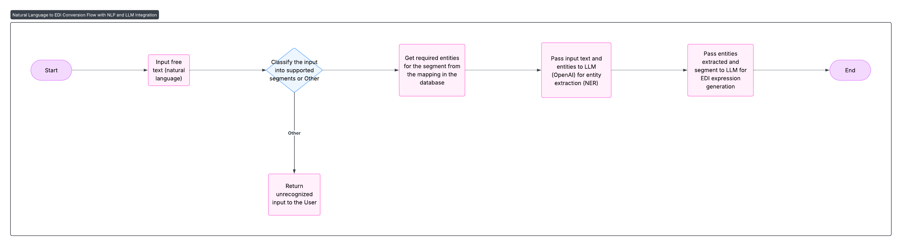

# 📝 EDI-Converter

Convert natural language (free text) invoices or purchase orders into standardized **EDI** (006010) segments using Python and OpenAI.

---

## How it Works

1. **Accept** any natural-language snippet (email body, chat line, etc.).
2. **Classify** it into one of the supported segments  
   `["BIG", "DTM", "N1", "N3", "IT1"]` — or `"Other"` if unknown.
3. **Look up** the required entities for that segment from your mapping DB.
4. **Extract** those entities with OpenAI (strict JSON schema, 0-temp).
5. **Generate** the final EDI segment string with the same model.

(Feel free to change the design https://lucid.app/lucidchart/05f28b0c-f453-4f58-a3b1-b06c4cc2076a/edit?viewport_loc=-2069%2C-1427%2C4255%2C1976%2C0_0&invitationId=inv_199836a3-2c83-4f3f-805f-1f13aac623ec)

---

## Supported Segments

- `BIG` (Beginning Segment for Invoice)
- `DTM` (Date/Time Reference)
- `N1` (Name)
- `N3` (Address Information)
- `IT1` (Baseline Item Data)
- `Other` (fallback if none matched)

---

## Sample Flow

### 1. Input (Free Text)
Invoice Date: Wed, 06 Mar 2024; Invoice Number: 0090033344; Purchase Order Date: Wed, 28 Feb 2024; Purchase Order Number: 9681490453

### 2. Step-by-Step

| Step | What happens                                                         | Example Data Output                                    |
|------|-----------------------------------------------------------------------|--------------------------------------------------------|
| 1    | **Classify Segment**                                                  | `BIG`                                                  |
| 2    | **Get Required Entities** from mapping DB                             | `[{"entity_name": "DATE", ...}, {"entity_name": "INVOICE NUMBER", ...}, ...]` |
| 3    | **Extract Entities** with OpenAI LLM                                  | `[{"entity_name": "DATE", "value": "Wed, 06 Mar 2024"}, ...]` |
| 4    | **Generate EDI Expression** with OpenAI using the extracted entities  | `BIG*20240306*0090033344*20240228*9681490453`          |

### 3. Flow Table

| Step   | Data                                                                                                   |
|--------|--------------------------------------------------------------------------------------------------------|
| Input  | `Invoice Date: Wed, 06 Mar 2024; Invoice Number: 0090033344; Purchase Order Date: Wed, 28 Feb 2024; Purchase Order Number: 9681490453` |
| Classify | `BIG`                                                                                               |
| Required Entities | `[{"entity_name": "DATE", "required": True, "type": "DATE", "description": "Invoice Date"}, {"entity_name": "INVOICE NUMBER", "required": True, "type": "INTEGER", "description": "Invoice Number"}, ...]` |
| Extracted Entities | `[{"entity_name": "DATE", "value": "Wed, 06 Mar 2024"}, {"entity_name": "INVOICE NUMBER", "value": "0090033344"}, ...]`         |
| EDI Output | `BIG*20240306*0090033344*20240228*9681490453`                                                      |

---